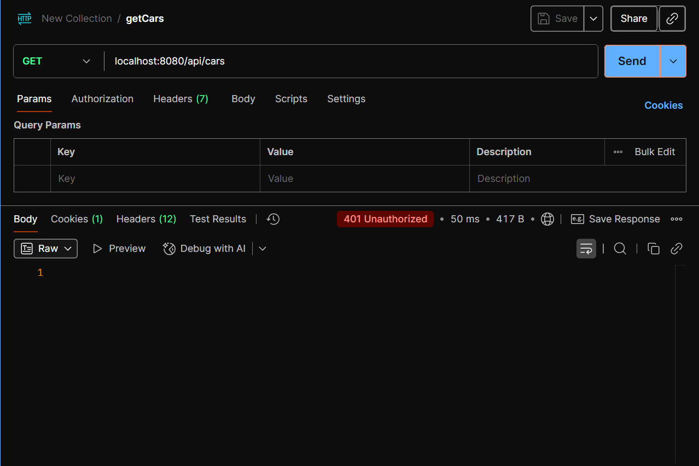

# 입실 체크 해주세요 !! 💌
1. Intellij
2. Visual Studio Code
3. MariaDB - HeidiSQL
4. Postman
5. 오늘분까지의 프로젝트 강사 깃허브에서 다운로드

# 금일 수업 계획
1. RESTful API 문서화 - 여기까지 cardatabase # 1
2. 백엔드 보호 - cardatabase # 2 만들어서 할겁니다.
3. 백엔드 test case - cardatabase # 3 만들건데, 이때만 쓰고 # 2 기준으로 백엔드-프론트엔드 연결 예정

# RESTful API 문서화
- RESTful API는 이를 이용하는 개발자가 그 기능과 작동을 이해할 수 있도록 적절하게 문서화 되어야 합니다.
- 내가 개발하는데 왜 문서가 필요하냐고 하시면 안됩니다... 
- 이번에는 Open API 3 를 이용하여 이용할 수 있는 엔드포인트 목록 / 허용되는 데이터 양식 / API와 상호작용하는 방법 등을 포함시킬 예정입니다.

OpenAPI3를 이용한 자동 문서 생성 방식(이전에는 Swagger 명세라고 했습니다)인데, 이는 RESTful API를 위한 API 설명 명세서에 해당합니다. RAML도 있기는한데 한국에서는 잘 안쓰는 것 같습니다.

OpenAPI도 라이브러리입니다.
1. SpringDoc OpenAPI Starter WebMVC UI 얘 쓸겁니다.
`	implementation 'org.springdoc:springdoc-openapi-starter-webmvc-ui:2.0.2'`

이제 아셔야 될 점은 '외부 라이브러리'를 사용한다면 Java 자체를 이용하는 것이 아니기 때문에 _의존성 추가_ 가 선행돼야 한다는 점입니다.
그럼 의존성 추가는 어디서 한다 ? -> build.gradle에서 한다. -> 여기 dependencies 수정했다면? -> 코끼리 눌러야 한다.

2. com.example.cardatabase 패키지에 OpenApiConfig 클래스를 생성. 저는 종종 Config와 관련된 표현을 웬만하면 영어로 그대로 쓸건데 혹시 구성 이라고 이야기하면 config이라고 생각하시면 되겠습니다.

```java
package com.example.cardatabase;

import io.swagger.v3.oas.models.OpenAPI;
import io.swagger.v3.oas.models.info.Info;
import org.springframework.context.annotation.Bean;
import org.springframework.context.annotation.Configuration;

@Configuration
public class OpenApiConfig {
    
    @Bean
    public OpenAPI carDatabaseOpenApi() {
        return new OpenAPI()
                .info(new Info()
                        .title("Car REST API")
                        .description("My car Stock")
                        .version("1.0")
                );
    }
}
```
이상의 코드에서 학습해야 할 부분은 `@Bean`이라는 애너테이션입니다. 
그리고 return new OpenApi.info(...); 라는 지점에서 chaining method 개념을 도입했고, 거기 new Info() 내에서 객체 생성을 빌더 패턴으로 했다는 점에 주목하시면 됩니다. 그러면 `@Bean` 빼고는 전부 다 학습한 내용입니다.

3. application.properties도 수정할겁니다.

```property
spring.application.name=cardatabase
spring.datasource.url=jdbc:mariadb://localhost:3310/cardb
spring.datasource.username=root
spring.datasource.password=1234
spring.datasource.driver-class-name=org.mariadb.jdbc.Driver
spring.jpa.generate-ddl=true
spring.jpa.hibernate.ddl-auto=create-drop
spring.data.rest.basePath=/api
springdoc.swagger-ui.enabled=true
springdoc.swagger-ui.path=/swagger-ui.html
springdoc.api-docs.path=/api-docs
```

이후
http://localhost:8080/swagger-ui.html


# Bean / @Bean
- Spring에서 Bean은 스프링 IoC(Inversion of Control : 제어의 역전) 컨테이너가 관리하는 Java 객체를 의미합니다. 

## Bean의 정의
Spring이 등장하기 전에는 개발자가 직접 new 키워드를 통한 객체 생성을 하고, 객체 간의 의존성을 관리했었습니다(우리가 Java 시간에 해왔던 겁니다). 얘가 편하게 느껴지시기는 할건데 프로젝트가 커질 수록 코드가 복잡해지고 유지 보수가 어려워지는 단점이 있습니다.
예를 들어 A 클래스를 정의하고 B 클래스에서 A 클래스의 객체를 만들었을 때, A 클래스의 내부를 수정했더니 B에서 코드 오류가 나는 경우가 빈번했던 겁니다.

Spring에서는 이상의 문제를 IoC 개념을 통해서 해결했습니다. 개발자가 직접 특정 클래스에서 객체를 생성하는 것이 아니라 Spring IoC 컨테이너에게 객체 생성 자체를 위임합니다. 스프링 컨테이너는 애플리케이션에서 필요한 객체들을 미리 생성해두고(Bean), 필요할 때 특정 클래스에게 주입을 해줍니다. 이렇게 스프링 컨테이너에 의해 관리되는 객체를 _빈_ 이라고 합니다.

그리고 이 bean은 싱글톤 스코프로 관리됩니다. 그러면 전체를 통틀어서 하나의 객체만 생성되는 것을 담보하기 때문에 메모리 효율성을 높이고 일관된 상태를 유지할 수 있습니다.

## @Bean 애너테이션
`@Bean` 애너테이션은 메서드에 붙여서 사용하며, 이 메서드가 반환하는 객체를 스프링 컨테이너에 빈으로 등록하겠다는 의미입니다.

### @Bean 애너테이션 사용 방법
`@Bean`은 주로 `@Configuration`이 붙은 클래스 내부의 메서드에서 사용됩니다. `@Confiuration`은 해당 클래스가 빈 설정 정보를 가지고 있음을 나타냅니다.

- 우리가 OpenAPI를 도입했을 때의 애너테이션을 확인하시면 됩니다.
```java
package com.example.cardatabase;

import io.swagger.v3.oas.models.OpenAPI;
import io.swagger.v3.oas.models.info.Info;
import org.springframework.context.annotation.Bean;
import org.springframework.context.annotation.Configuration;

@Configuration
public class OpenApiConfig {

    @Bean
    public OpenAPI carDatabaseOpenApi() {
        return new OpenAPI()
                .info(new Info()
                        .title("Car REST API")
                        .description("My car Stock")
                        .version("1.0")
                );
    }
}
```

### @Bean의 사용 여부에 따른 코드 라인의 차이
1. @Bean을 사용하지 않았을 때의 예시
  - @Bean을 사용하지 않으면 개발자가 직접 객체를 생성하고 관리합니다.

```java
public class MyService {
  public void doSomething() {
    System.out.println("이 method가 무슨 짓을 하고 있습니다.");
  }
}

public class MyController {
  // 개발자가 직접 메서드를 호출하기 위해서 객체를 생성했습니다.

  // 필드 등록
  private Myservice myservice;

  public MyService() {
    myService = new MyService();
  }

  public void handleRequest() {
    myService1.doSomething();// MyController 클래스에서 MyService 객체를 만든 다음에 메서드를 호출했습니다.
  }
}
```
그러면 현재까지의 저희가 봤을 때는 전혀 전혀 전혀 이상한게 없습니다. 여태까지 그렇게 해왔으니까요.

이상의 방식은 의존성 주입(Dependency Injection)을 활용하지 않아, 객체 간의 결합도가 높아지고 테스트 및 유지 보수가 어렵다는 단점이 있습니다. 즉 MyConroller 클래스만 테스트를 해보고 싶어도 내부에서 MyService 객체를 만들어버리니까 MyService 클래스까지 무조건 같이 테스트를 해야한다는 부분이 문제입니다. 만약에 특정 클래스에서 다른 클래스의 객체를 300개 만들면 301개의 클래스를 테스트해봐야겠죠.

2. @Bean을 사용했을 때의 예시
- @Bean을 사용하면 스프링 컨테이너가 MyService 클래스의 객체를 생성하고 관리합니다. 그리고 `@Autowired`를 통해서 이 객체를 주입 받아 사용합니다.

```java
@Configuration
public class AppConfig {

  // MyService 객체를 빈으로 등록하는 과정
  @Bean
  public MyService myService() {
    return new MyService();
  }
}

public class MyService {
  public void doSomething() {
    System.out.println("얘가 뭘 또 합니다.");
  }
}

@Controller
public class MyController {
  private final MyService myService;    // 아까 위와의 차이점은 우리가 이 클래스에서 객체를 생성하지 않고서 field로 처리했다는 점이 되겠습니다.

  // 생성자 주입
  public MyController(MyService myService) {
    this.myService = myService
  }

  public void handleRequet() {
    myService.doSomething();
  }
}
```
이상의 예시에서 @Configuration 이 붙어있는 AppConfig 클래스는 스프링 빈 구성 클래스로 동작하게 됩니다. myService() 메서드에 @Bean 애너테이션을 붙여서, 결과값이 MyService의 객체가 되고, 이를 스프링 컨테이너에 등록하게 됩니다. 이상의 작업이 선행되게 되면 MyController 클래스에서는 new 키워드 없이, 생성자를 통해 바로 스프링 컨테이너로부터 MyService 객체를 전달 받아서 사용할 수 있습니다. 그러면 객체가 통째로 하나만 있다는 것을 담보 할 수 있기 때문에 new를 쓸 때 처럼 객체 개수가 계속 늘어나지도 않고, 메모리 효율성과 일관성을 가질 수 있으면서도 MyController - MyService 클래스 간의 결합도도 낮추는 효과를 지닙니다.

# 백엔드 보호로 넘어가기 전에 push 하겠습니다.
git add .
git commit -m "feat: RESTful API + Swagger"
git push

# 백엔드 보호
1. Spring Security
2. JWT를 이용한 백엔드 보호
3. Role-based 보호

## Spring Security
- 자체 기능
  1. 인메모리 사용자 하나를 포함하는 AuthenticationManager 빈. 사용자 이름은 user고, 암호는 Console에 실행할 때마다 출력됩니다.
  2. `/css`, `/images` 같은 일반적인 정적 리소스 위치의 경로를 무시. 다른 모든 엔드 포인트에 대한 HTTP 기본 인증
  3. 스프링 ApplicationEventPublisher 인터페이스로 게시되는 보호 이벤트
  4. HSTS, XSS, CSRF를 비롯한 일반적인 저수준 기능을 기본적으로 활성화.
  5. 자동 생성되는 기본 로그인 페이지(한 번만 쓰고 안쓸거긴 합니다 - 저희가 지금 프론트가 없어서 임시적으로 쓰는 부분).

### Spring Security의 도입
1. build.gradle에 관련 의존성을 추가할겁니다.
  - mvn에서 spring boot starter security를 검색
```java
	implementation 'org.springframework.boot:spring-boot-starter-security'
	testImplementation 'org.springframework.boot:spring-boot-starter-security'
```
spring-boot-starter-security:버전명이 있었는데 버전 명시했을 경우에 오류 발생합니다. 203/204번 라인 기준으로 의존성을 추가하시기 바랍니다.

http://localhost:8080으로 접속하게 되면 지가 알아서
http://localhost:8080/login 이라고 하는 엔드포인트로 이동하는 것을 확인할 수 있습니다.
이상의 과정에 username : user / password는 콘솔에 출력된 비밀번호를 붙여넣기 하시면
http://localhost:8080/?continue 로 이동하는 것을 확인할 수 있는데 저희는 현재 
http://localhost:8080에 아무것도 입력한게 없기 때문에 whitelabel page가 나옵니다.
http://localhost:8080/api/cars 이런거 들어갔을 때(API 명세서에서 본 거 들어가보셨을 때), 데이터가 이전과 같이 나온다면 정상 처리된겁니다.

Spring Security의 작동 방식을 _구성_ 하려면 Config class를 추가해야합니다. 특정 역할이나 사용자가 접근 가능한 URL 또는 URL 패턴을 정의할 수 있고, 인증 메커니즘, 로그인 프로세스, 세션 관리 등을 정의하는 클래스에 해당합니다.

그래서 com.example.cardatabase 패키지에 SecurityConfig 클래스를 생성합니다.

```java
package com.example.cardatabase;

import org.springframework.context.annotation.Bean;
import org.springframework.context.annotation.Configuration;
import org.springframework.security.config.annotation.web.configuration.EnableWebSecurity;
import org.springframework.security.core.userdetails.User;
import org.springframework.security.core.userdetails.UserDetails;
import org.springframework.security.crypto.bcrypt.BCryptPasswordEncoder;
import org.springframework.security.crypto.password.PasswordEncoder;
import org.springframework.security.provisioning.InMemoryUserDetailsManager;

@Configuration
@EnableWebSecurity
public class SecurityConfig {
    @Bean
    public InMemoryUserDetailsManager userDetailsService() {
        UserDetails user = User.builder()
                .username("user")
                .password(passwordEncoder().encode("password"))
                .roles("USER")
                .build();
        return new InMemoryUserDetailsManager(user);
    }
    // 이거는 암호화를 위한 과정입니다.
    @Bean
    public PasswordEncoder passwordEncoder() {
        return new BCryptPasswordEncoder();
    }
}
```
이상의 SecurityConfig의 @Configuration, @EnableWebSecurity 애너테이션은 기본 웹 보호 구성을 해제하며, 이 클래스에서 자체 Config를 정의할 수 있도록 합니다. -> 즉 애초에 Spring Security에서 지원하는 보호 Config 관련 설정들이 있는데 우리가 커스텀하겠다는 뜻입니다.
인메모리 사용자를 추가했는데 사실 이건 이번 테스트에만 쓸거기 때문에 큰 의미는 없고 오히려 @Bean을 통해서 객체를 스프링 컨테이너에 등록했고, 또한 PasswordEncoder 클래스의 객체를 생성하여 앞으로 암호 입력을 하더라도 DB에는 암호화가 이루어진 상태를 구현했다는 부분을 주목해야 합니다.
이상의 코드 구현에서는 결과적으로 username이 user / 비밀번호가 password(암호화 완료된) / 역할은 USER로 정의된 인메모리 사용자를 생성했다는 점이 되겠습니다.(builder pattern으로 만들었다는 것에도 주목해야 합니다.)

인메모리 사용자를 만드는 것은 개발 단계에서는 괜찮지만 운영 환경에서는 사용자 정보를 DB에 저장합니다.
그리고 유저 정보를 DB에 저장하려면 엔티티 클래스와 리포지토리 클래스가 있어야겠죠.
그리고 암호도 일반 텍스트 형식으로 DB에 저장되어서는 안될 거고, 암호화 과정이 필요할겁니다.

1. com.example.cardatabase.domian 패키지에 AppUser 클래스를 만들겠습니다.

```java
package com.example.cardatabase.domain;

import jakarta.persistence.*;
import lombok.Getter;
import lombok.NoArgsConstructor;
import lombok.RequiredArgsConstructor;
import lombok.Setter;

@Entity
@NoArgsConstructor(force = true)
@RequiredArgsConstructor
@Getter
@Setter
public class AppUser {
    @Id
    @GeneratedValue(strategy = GenerationType.AUTO)
    @Column(nullable=false, updatable = false)
    private Long id;
    
    @Column(nullable = false, unique = true)
    private final String username;
    
    @Column(nullable = false)
    private final String password;
    
    @Column(nullable = false)
    private final String role;
}
```

이상의 코드에서 처음으로 @Column 사용을 통한 구체적인 컬럼 설정을 해봤습니다. name = 속성으로 컬럼명을 새로 커스텀하는 것부터 nullable로 null 허용 여부 / unique를 통해서 다른 row들과의 차이를 식별할 것인지를 지정할 수 있습니다.
username의 경우 일치하게 되면 user들이 서로가 다른 사람인지 인지할 수 없으니 username은 unique 설정을, 비밀번호의 경우에는 애초에 인코딩 되기도 하고 남이 알 일이 없으니 unique=false 로 설정했습니다. 특정 컬럼이 어떤 속성을 지녀야 하는지는 설계 단계에서 고민해봐야 합니다.

2. AppUserRepository를 생성. -> 설정하세요.
```java
package com.example.cardatabase.domain;

import org.springframework.data.jpa.repository.JpaRepository;

import java.util.Optional;

public interface AppUserRepository extends JpaRepository<AppUser, Long> {
    Optional<AppUser> findByUsername(String username);
}
```
이상의 코드에서 주목해야 할 점은 여태까지 CarRepository에 추상 메서드들을 정의할 때는 결과값들이 기본적으로 복수로 나오기 때문에 List 자료형을 썼었지만 findByUsername()의 경우에는 username 필드가 unique=true이기 때문에 기본적으로 결과값이 하나이거나 아니면 0개가 나오게 될겁니다. 그래서 return type을 List로 설정하는 것은 적절하지 않은 선택지가 될겁니다.
그렇다면 AppUser를 return하는 것이 적절하지만 예를 들어 옛날에는
```java
public AppUser findByusername(String username) {
  if (username이 DB내에서 일치하는 username이 있다면) {
    return 일치하는 객체 전체 리턴
  }
  return null; 
}
```
와 같은 로직이 기본적으로 필요할겁니다. 근데 여기는 interface이기 때문에 일반 메서드를 작성하지 못합니다. 그 말은 결과적으로 AppUser를 return type으로 지정하게 되면 AppUserRepository를 import 해오는 곳 마다 위의 로직을 계속 복사붙여넣기 해야한다는 뜻이 되겠네요.

그래서 Optional이라고 하는 클래스가 새로 나오게 되었습니다. 얘는 null값으로 return 되더라도 일단 오류가 안납니다.

3. domain과 같은 위치 service 패키지를 생성
4. service 패키지 내에 UserDetailsServiceImpl이라는 클래스를 만들겠습니다.
  - 되게 거지같고 길고 한 이름인데 Impl은 implement를 뜻합니다.
  - implements의 의미는 특정 인터페이스의 추상 메서드들을 강제 구현하기 위핸 명령어였습니다.
  - 그래서 특정 클래스명이 Impl로 끝나게 된다면 이는 어떠한 인터페이스를 구현한 클래스라고 해석하시면 됩니다.
  - 인터페이스명Impl.java 의 형태로 작성됩니다.

```java
package com.example.cardatabase.service;

import com.example.cardatabase.domain.AppUser;
import com.example.cardatabase.domain.AppUserRepository;
import org.springframework.security.core.userdetails.User;
import org.springframework.security.core.userdetails.User.UserBuilder;
import org.springframework.security.core.userdetails.UserDetails;
import org.springframework.security.core.userdetails.UserDetailsService;
import org.springframework.security.core.userdetails.UsernameNotFoundException;
import org.springframework.stereotype.Service;

import java.util.Optional;

@Service
public class UserDetailsServiceImpl implements UserDetailsService {
    private final AppUserRepository userRepository;

    public UserDetailsServiceImpl(AppUserRepository userRepository) {
        this.userRepository = userRepository;
    }

    @Override
    public UserDetails loadUserByUsername(String username) throws UsernameNotFoundException {
        Optional<AppUser> user = userRepository.findByUsername(username);

        UserBuilder builder = null;
        if (user.isPresent()) { // 이하의 실행문이 실행된다면 user에 AppUser 객체가 있다는 의미
            AppUser currentUser = user.get();
            builder = User.withUsername(username);
            builder.password(currentUser.getPassword());
            builder.roles(currentUser.getRole());
        } else {
            throw new UsernameNotFoundException("User not found.");
        }
        
        return builder.build();
    }
}
```

이상의 코드에서 생기는 의문점은 멀쩡하게 있는 AppUser 클래스의 객체인 user를 그대로 쓰는 것이 아니라 무슨 UserBuilder인가 하는 다른 클래스의 객체인 builder를 선언해놓고, 거기 내부에 AppUser의 field 값들을 하나씩 대입하는 로직이 있다는 것을 확인할 수 있습니다.
이는 인터페이스의 정의를 명확하게 알지 못하면 되게 효율적이지 못한 코드로 해석될 여지가 있습니다.
인터페이스 내에는 추상 메서드만 존재합니다. 그리고 이를 구현하는 클래스는 인터페이스 내에 있는 추상 메서드들을 강제로 _구현(implement)_ 해야만 합니다. 이미 우리가 AppUser라는 entity 클래스를 만들기 이전에 있는 인터페이스를 구현했으므로 당연히 거기에 있는 추상 메서드들의 return type은 AppUser가 아닐겁니다.
또한 다른 개발자들도 이 인터페이스를 구현할거니까 특정 프로젝트에 맞는 entity 클래스라기 보다는 보편적인 형태의 return type을 요구하게 될거라고 생각할 수 있습니다.
그렇게 추상 메서드의 return type이 고정되어 있으므로 우리는 우리가 만든 entity class의 객체를 UserDetails 클래스의 객체 형태로 대입해줄 필요가 있기 때문에 if문 내부의 실행문에서 해당 로직이 존재하게 됩니다.

- 이상의 코드는 Spring Security 인증 처리 시 DB에서 사용자를 가져오기 위해서 UserServiceDetailsImpl 클래스에 AppRepository 클래스를 주입했습니다. 그리고 AppUserRepository에는 findByUsername() 메서드를 Optional 결과값이 나오도록 작성해뒀습니다. 그래서 Optional에 딸린 메서드인 isPresent() 메서드를 통해 특정 username을 지닌 AppUser가 있는지를 체크할 수 있게 됩니다. 그래서 user가 없다면 UsernameNotFoundException 예외를 발생시켜서 던집니다(throw).
- 그리고 강제 구현하도록 된 loadUserByUsername() 메서드는 인증(authentication)에 필요한 UserDetails 객체를 반환합니다(return type 확인할 것). 

gitignore 관련
git add .
git commit -m "test"
git push
- 실패함...

이제 SecurityConfig에서 Spring Security가 인메모리 사용자 대신 데이터베이스의 사용자를 이용하도록 지정할겁니다.
그래서 userDetailsService() 메서드를 째로 삭제할거니까, 현재 버전의 SecurityConfig 파일을 좀 옮겨놓도록하겠습니다.
```java
package com.example.cardatabase;

import org.springframework.context.annotation.Bean;
import org.springframework.context.annotation.Configuration;
import org.springframework.security.config.annotation.web.configuration.EnableWebSecurity;
import org.springframework.security.core.userdetails.User;
import org.springframework.security.core.userdetails.UserDetails;
import org.springframework.security.crypto.bcrypt.BCryptPasswordEncoder;
import org.springframework.security.crypto.password.PasswordEncoder;
import org.springframework.security.provisioning.InMemoryUserDetailsManager;

@Configuration
@EnableWebSecurity
public class SecurityConfig {
    @Bean
    public InMemoryUserDetailsManager userDetailsService() {
        UserDetails user = User.builder()
                .username("user")
                .password(passwordEncoder().encode("password"))
                .roles("USER")
                .build();
        return new InMemoryUserDetailsManager(user);
    }
    // 이거는 암호화를 위한 과정입니다.
    @Bean
    public PasswordEncoder passwordEncoder() {
        return new BCryptPasswordEncoder();
    }
    // 20250924 14:40에 업로드합니다.
    // 한 번 더
}
```
method 날리고 나니까 인메모리 사용자 관련 정보가 전부 다 날아갔습니다.
그러면
login이 불가능하네요.

근데 이런 경우에 애초에 SecurityConfig.java가 없었을 때는 콘솔에 비밀번호가 찍혔었습니다.
근데 이번에는 안나와있습니다.

즉, SecurityConfig 자체가 한국어로 보안구성 관련 클래스인 만큼 얘를 생성하는 순간에 Spring Security의 default 인증 관련 설정이 싸그리 사라진다고 볼 수 있습니다.

```java
package com.example.cardatabase;

import com.example.cardatabase.service.UserDetailsServiceImpl;
import org.springframework.context.annotation.Bean;
import org.springframework.context.annotation.Configuration;
import org.springframework.security.config.annotation.authentication.builders.AuthenticationManagerBuilder;
import org.springframework.security.config.annotation.web.configuration.EnableWebSecurity;
import org.springframework.security.crypto.bcrypt.BCryptPasswordEncoder;
import org.springframework.security.crypto.password.PasswordEncoder;

@Configuration
@EnableWebSecurity
public class SecurityConfig {
    private final UserDetailsServiceImpl userDetailsService;

    public SecurityConfig(UserDetailsServiceImpl userDetailsService) {
        this.userDetailsService = userDetailsService;
    }
    
    public void configGlobal (AuthenticationManagerBuilder auth) throws Exception {
        auth.userDetailsService(userDetailsService).passwordEncoder(new BCryptPasswordEncoder());
    }

    @Bean
    public PasswordEncoder passwordEncoder() {
        return new BCryptPasswordEncoder();
    }
}
```

변경 이후입니다. userDetailsService 관련하여 얘가 method인지 field명인지 객체명인지 구분을 할 필요가 있습니다. 색깔 확인 잘하시기 바랍니다.

CarDatabaseApplication.java에 AppUser 관련 더미 데이터를 추가했습니다. 알아서 확인하세요.
그런데 주의하실 점은 owner1 / 2 만들 때는 객체명 따로 지정한 다음에 만들어놓고
owerRepository.save(owner1);
owerRepository.save(owner2);
형태로 저장했는데, 
이번에 AppUser 만들 때는
userRepository.save(new AppUser(username, password, role)); 형태로 저장했었습니다.
코드 라인 상의 차이 Java 수업 때도 많이 봐왔지만 한 번 확인하시기 바랍니다.

- 참조 : bcrypt는 해싱 함수로, 암호화를 할 때 자주 사용되는 개념입니다. 해싱된 결과는 항상 다르게 나오기 때문에 여러분이 직접 해싱 사이트 들어가서 비밀번호를 넣고 결과값을 AppUser() 내부의 argument로 넣어야 합니다.

이상까지의 과정을 거치고 Springboot Project를 재실행하게 됐을 때, HeidiSQL을 켜서 들어가면 app_user 테이블에서 더미 데이터를 확인할 수 있습니다.

또한 http://localhost:8080으로 접속하게 되면 자동으로 /login으로 리다이렉팅되면서 id / password를 요구하는데, 우리가 만든 username / password를 이용해서 로그인이 가능해졌습니다.

그런데 postman에서 GET http://localhost:8080/api/cars를 시도했을 때, 여태까지와 다르게 401 Unauthorized 라는 표현이 나왔습니다.


이제 DB에 접속을 할 때 데이터베이스의 사용자를 인증에 이용한다는 점입니다.

GET 요청할 때는 저희가 뭐 굳이 하는 거 없이 URL에 send 버튼만 보내면 그만이었는데, 인증 절차를 작성한 이후에는 요구사항이 있습니다.
POST 요청할 때 봤던 headers 있는 탭 부분에 Authorization이라는 부분이 있습니다.
Authorization -> Basic Auth -> 우리 username / password 사용 한 후에 GET 요청을 날려보시면 결과값이 200 OK가 나왔을 때 정상입니다.

그리고 postman에서 http://localhost:8080/api/appUsers 엔드포인트로 GET 요청을 날려보면 회원들의 id / username / hashing된 password가 전부 드러나는 것을 알 수 있습니다.

이는 기본적으로 Spring Data REST가 모든 리포지토리에 대해서 RESTful 웹 서비스를 자동으로 생성하기 때문에 일어나는 일입니다. 이를 막기 위한 방법으로
`@RepositryRestResource(exported = false)`

```java
package com.example.cardatabase.domain;

import org.springframework.data.jpa.repository.JpaRepository;
import org.springframework.data.rest.core.annotation.RepositoryRestResource;

import java.util.Optional;

@RepositoryRestResource(exported = false)
public interface AppUserRepository extends JpaRepository<AppUser, Long> {
    Optional<AppUser> findByUsername(String username);
}
```
이제 `@RepositryRestResource` 얘 관련한 거 ctrl + f 해서 전체 정리 한 번 해보시기 바랍니다.

## JWT로 백엔드 보호
- 이전까지 수업한 내용은 아까 postman에서 봤던 것처럼 basic auth에 해당합니다. 이러한 기본 인증은 토큰을 처리하거나 세션을 관리하는 방법을 제공하지 않습니다. 그냥 username과 password가 일치하는지만 확인할 뿐입니다. 그리고 사용자가 로그인할 때 각 요청과 함께 자격 증명이 전송되기 때문에 잠재적인 보안 위협이 있는 방식이라고 할 수 있습니다. 

- 이상의 방법으로는 React 활용 프론트엔드를 개발할 때 사용할 수 없기 때문에 JWT를 활용한 인증을 도입할겁니다.

### JWT
- 인증 구현 방법 중 하나로, 인증 및 권한 부여 목적으로 RESTful API에서 가장 보편적으로 사용되는 방식입니다.
- 인증(Authentication) : 보통 로그인 과정과 관련
- 인가/권한 부여(Authorization) : 특정 역할이 특정 페이지를 들어갈 수 있는지 없는지 여부.
  - 즉 인증은 받았기 때문에 로그인이 가능하긴 하지만 회원이 다른 회원을 삭제할 권한은 없는 반면에 관리자는 다른 회원을 삭제할 권한을 부여 받는 등. 인증 이후의 절차에 가깝습니다.

- JWT는 크기가 매우 작기 떄문에 URL / POST 매개변수 또는 헤더 내부에 담아서 전송하는 것이 가능합니다. 특히 postman 상에서의 요청을 할 때 예시를 보여드릴 예정입니다.

- JWT 내부에는 사용자 이름과 역할 등 사용자에 대한 모든 필수 정보를 담을 수 있습니다.

### JWT의 구조
- 기본 구조 : xxxxxxx.yyyyyyyy.zzzzzzz
  - xxxxx 부분 : 토큰의 유형과 해싱 알고리즘을 정의하는 헤더(Header)
  - yyyyy 부분 : 페이로드로 인증에서 일반적으로 사용자 정보를 포함함.
  - zzzzz 부분 : 서명으로, 토큰이 도중에 변경되지 않았는지 확인하는 데 이용.


### JWT 생성 및 해석과 응용 과정
1. Java / Android 용 JWT 라이브러리인 jjwt 라이브러리 의존성을 추가해야 합니다.
  - jwt -> JSON Web Token -> JavaScript Object Notation Web Token 
  - jjwt -> Java JavaScript Object Notation Web Token

2. 로그인 보호
  1. JWT를 생성하고 검증하는 클래스를 만들겁니다. service 패키지에서 JwtService 클래스를 만들겁니다.

```java
package com.example.cardatabase.service;

import org.springframework.stereotype.Component;

@Component
public class JwtService {
    // 1일(밀리초). 실제 운영시에는 더 짧은게 낫습니다.
    static final long EXPIRATIONTIME = 86400000;
    static final String PREFIX = "Bearer";
}
```
만료시간 필드의 경우에는 그냥 1일을 밀리초 단위로해서 곱한 개념입니다.
PREFIX는 토큰의 접두사를 의미하는데, 일반적으로 "Bearer" 스키마가 이용되는 편입니다.
JWT는 Authorization 헤더로 전송되면서 Bearer 스키마를 이용하는 경우의 예시는 이하와 같습니다.
`Authorization: Bearer <token>`
Bearer 뒤에 공백이 있습니다. 나중에 접두사를 제거하고 token의 값만 가지고 유효성을 검증해야하기 때문에 Bearer 접두사를 제거하는 과정에서 공백을 제거하지 않는 바람에 결과값이
`<token>`이 아니라 ` <token>`이 되어서 유효성 검증에 통과하지 못하는 분들이 많습니다.
_진짜진짜주의주의_

  2. jjwt 라이브러리의 secretKeyFor() 메서드를 이용하여 비밀 키를 생성할겁니다. 시연용으로만 사용될거고 실제 DB에는 잘 모르겠습니다. 운영 환경 상에서는 애플리케이션 구성에서 비밀 키를 읽어와야 하는 등 차이가 약간 생기게 됩니다. 
    - 이후 getToken() 메서드를 활용하여 토큰을 생성하고 return
    - getAuthUser() 메서드를 통해 Authorization 헤더에서 토큰을 가져오게 됩니다.
    - jjwt 라이브러리에서 제공하는 parseBuilder() 메서드를 활용, jwtParseBuilder 인스턴스를 생성할겁니다.
    - setSigningKey() 메서드로 토큰 확인을 위한 비밀 키 지정을 합니다(setter입니다)
    - parseClaimsJws() 메서드로 Authorization 헤더에서 Bearer 접두사를 제거합니다(매우매우중요중요)
    - getSubject() 메서드로 username을 가져올겁니다. 아래에는 이상의 과정을 코드로 작성한 예시입니다.
```java
package com.example.cardatabase.service;

import io.jsonwebtoken.Jwts;
import io.jsonwebtoken.SignatureAlgorithm;
import io.jsonwebtoken.security.Keys;
import jakarta.servlet.http.HttpServletRequest;
import org.springframework.http.HttpHeaders;
import org.springframework.stereotype.Component;

import java.security.Key;
import java.util.Date;

@Component
public class JwtService {
    // 1일(밀리초). 실제 운영시에는 더 짧은게 낫습니다.
    static final long EXPIRATIONTIME = 86400000;
    static final String PREFIX = "Bearer";

    //비밀키 생성.
    static final Key key = Keys.secretKeyFor(SignatureAlgorithm.HS256);

    // 서명이 이루어진 JWT 토큰을 생성
    public String getToken(String username) {
        String token = Jwts.builder()
                .setSubject(username)
                .setExpiration(new Date(System.currentTimeMillis() + EXPIRATIONTIME))
                .signWith(key)          // 18 번 라인에 생성한 비밀키로 서명
                .compact();
        return token;
    }

    // 요청(Request)의 Authorization 헤더에서 토큰을 가져온 뒤에 그 토큰 내부를 확인하고,
    // username을 가지고 오는 부분입니다.
    public String getAuthUser(HttpServletRequest request) {
        String token = request.getHeader(   // 이 클래스의 객체가 정확히 뭔지는 모르겠지만 method
                // 명을 봤을 때 Header를 가지고 온다는 것은 알 수 있죠.
                // 여기 Header는 postman에서 볼 수 있는 headers에 해당합니다.
                HttpHeaders.AUTHORIZATION
        );
        if (token != null) {
            String user = Jwts.parserBuilder()
                    .setSigningKey(key)
                    .build()
                    .parseClaimsJws(token.replace(PREFIX, ""))
                    .getBody()
                    .getSubject();

            if (user != null) {
                return user;
            }
        }
        return null;
    }
}
```
이상의 코드 쓰는 것에서 생겨난 문제점 미리 적어놓겠습니다.

build.gradle에서의 jjwt 관련 version 불일치로 인해서 parserBuilder() 메서드가 더이상 지원하지 않는다는 문제점이 발견됐습니다.

그래서 0.11.5로 수정하였습니다.

build.gradle의 의존성은 이제 다음과 같습니다.
```java
dependencies {
	implementation 'org.springframework.boot:spring-boot-starter-web'
	implementation 'org.springframework.boot:spring-boot-starter-data-jpa'
	// Spring Data REST 의존성 추가 영역
	implementation 'org.springframework.boot:spring-boot-starter-data-rest'

	developmentOnly 'org.springframework.boot:spring-boot-devtools'
//	runtimeOnly 'com.h2database:h2'
	runtimeOnly 'org.mariadb.jdbc:mariadb-java-client'
	testImplementation 'org.springframework.boot:spring-boot-starter-test'

	implementation 'org.projectlombok:lombok:1.18.42'
	annotationProcessor 'org.projectlombok:lombok:1.18.42'

	//OpenAPI 명세서 관련 의존성
	implementation 'org.springdoc:springdoc-openapi-starter-webmvc-ui:2.0.2'

	// Spring Sercurity 관련 의존성
	implementation 'org.springframework.boot:spring-boot-starter-security'
	testImplementation 'org.springframework.boot:spring-boot-starter-security'

	// jjwt 관련 설정
	implementation 'io.jsonwebtoken:jjwt-api:0.11.5'
	runtimeOnly 'io.jsonwebtoken:jjwt-impl:0.11.5'
	runtimeOnly 'io.jsonwebtoken:jjwt-jackson:0.11.5'
}
```
버전 불일치로 인한 코드 작성 방식의 변경은 빈번하게 일어나는 편입니다. 근데 최신 버전이 LTS로 넘어가기 전까지는 사용하지 않는 편이 좋습니다.

이상의 코드에서 일단은 getToken()을 통해서 토큰을 생성하는 메서드와,
getAuthUser() 메서드를 통해서 토큰을 확인하여 서명된 user를 return하도록 정의했습니다.

  3. Authentication을 위한 자격 증명 자체를 저장하는 클래스를 추가할 예정입니다. 여기서 Record라는 자료형을 사용하긴 할건데... 내일 합시다.


버전 최신화해서 다시 작성할 예정입니다.

git add .
git commit -m "feat: 20250924 RESTful API / Swagger / Spring Security / JWT"
git push

자격 증명 삭제
자리 정리